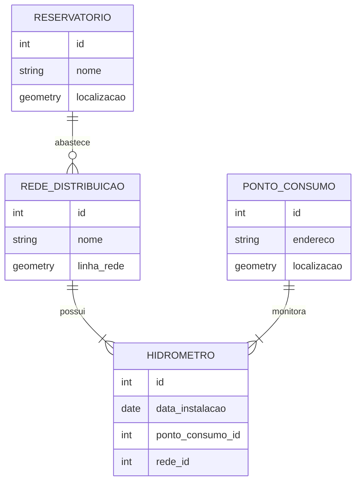

# Modelo Conceitual - Sistema de Distribuição de Água

```mermaid
erDiagram
    REDE_DISTRIBUICAO ||--|{ HIDROMETRO : possui
    RESERVATORIO ||--o{ REDE_DISTRIBUICAO : abastece
    PONTO_CONSUMO ||--|{ HIDROMETRO : monitora

    RESERVATORIO {
        int id
        string nome
        geometry localizacao
    }

    REDE_DISTRIBUICAO {
        int id
        string nome
        geometry linha_rede
    }

    PONTO_CONSUMO {
        int id
        string endereco
        geometry localizacao
    }

    HIDROMETRO {
        int id
        date data_instalacao
        int ponto_consumo_id
        int rede_id
    }
```
